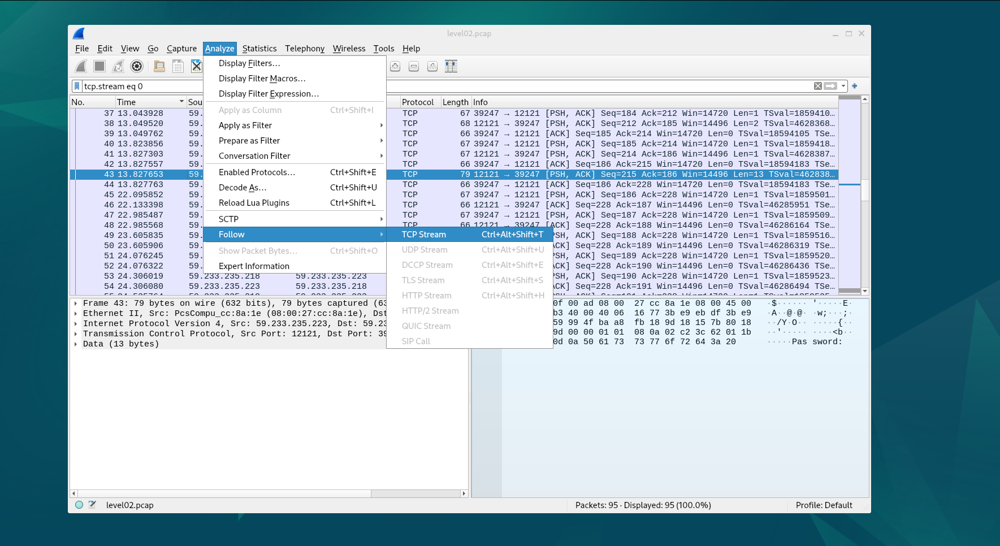

# Step1
Analyze the file `level02.pcap`  present in the `level02`'s home with wireshark

### Result

The dot represents a backspace character, so we can see that the password is `ft_waNDReL0L` for `flag02`

getflag gives us `kooda2puivaav1idi4f57q8iq`
